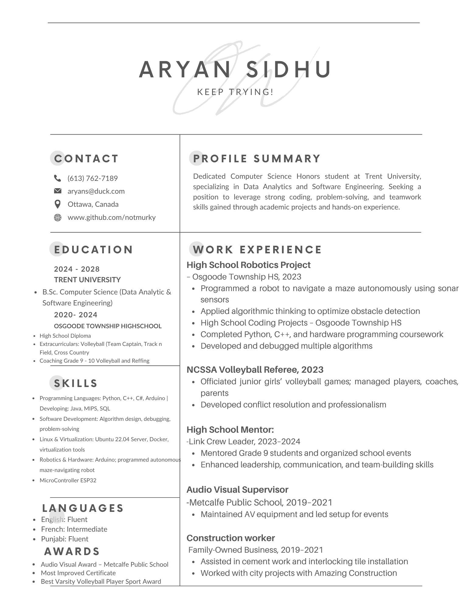

# Aryan Sidhu
**Keep Trying!**

---

## 📞 Contact
- **Phone:** (613) 762-7189  
- **Email:** [aryans@duck.com](mailto:aryans@duck.com)  
- **Location:** Ottawa, Canada  
- **GitHub:** [github.com/notmurky](https://github.com/notmurky)  

---

## 🎯 Profile Summary
Dedicated Computer Science Honors student at **Trent University**, specializing in **Data Analytics** and **Software Engineering**.  
Seeking a position to leverage strong **coding, problem-solving**, and **teamwork** skills developed through academic projects and hands-on experience.  

---

## 🎓 Education

**Trent University** (2024 – 2028)  
_B.Sc. Computer Science (Data Analytics & Software Engineering)_  
- Student Athlete – Men’s Varsity Volleyball  

**Osgoode Township High School** (2020 – 2024)  
- High School Diploma  
- Team Captain – Volleyball  
- Extracurriculars: Cross-Country, Track & Field, Basketball, Football  

---

## 💻 Skills
- **Languages:** Python, C++, C#, Arduino  
- **Developing:** Java, MIPS, SQL  
- **Software:** Algorithm design, debugging, problem-solving  
- **Linux & Virtualization:** Ubuntu 22.04 Server, Docker  
- **Robotics & Hardware:** ESP32, Arduino; maze-navigating robot  
- **Teamwork:** Experienced in individual and group projects  

---

## 💼 Work Experience

**High School Robotics Project** – Osgoode Township HS (2023)  
- Programmed a robot to navigate a maze autonomously using sonar sensors  
- Applied algorithmic thinking to optimize obstacle detection  

**NCSSA Volleyball Referee** (2023)  
- Officiated junior girls’ volleyball games  
- Developed conflict-resolution and professionalism  

**Link Crew Leader** (2023 – 2024)  
- Mentored Grade 9 students; organized events  
- Enhanced leadership, communication, and team-building skills  

**Audio Visual Supervisor** – Metcalfe Public School (2019 – 2021)  
- Maintained and operated AV equipment  
- Led setup for school events  

**Construction Volunteer** – Family-Owned Business (2019 – 2021)  
- Assisted in cement and interlocking tile installation  

---

## 🏆 Awards
- Audio Visual Award – Metcalfe Public School  
- Most Improved Certificate  
- Best Varsity Volleyball Player Paw Award  

---

